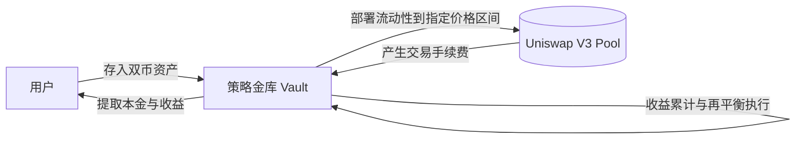

# CLSVault

CLSVault(Concentrated Liquidity Strategy Vault)是一个用于管理 Uniswap V3 LP 仓位的策略金库。用户存入双币资产后，金库会将资金统一部署到指定价格区间，集中管理手续费收益，并根据策略执行再平衡，以提升资金使用效率与策略执行一致性。

```mermaid
flowchart LR
    U[用户]
    V[策略金库 Vault]
    P[(Uniswap V3 Pool)]

    U -->|存入双币资产| V
    V -->|部署流动性到指定价格区间| P
    P -->|产生交易手续费| V
    V -->|收益累计与再平衡执行| V
    V -->|提取本金与收益| U
```

