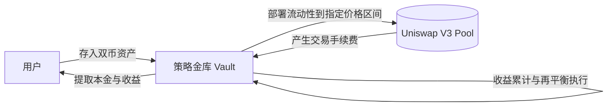

# CLSVault

CLSVault(Concentrated Liquidity Strategy Vault)是一个用于管理 Uniswap V3 LP 仓位的策略金库。用户存入双币资产后，金库会将资金统一部署到指定价格区间，集中管理手续费收益，并根据策略执行再平衡，以提升资金使用效率与策略执行一致性。

## 部署

1. 复制环境变量并填写 `PRIVATE_KEY` 与 RPC：

```bash
cp script/.env.example .env
# 编辑 .env：PRIVATE_KEY、MAINNET_RPC_URL、TESTNET_RPC_URL
```

2. 模拟部署（不上链）：

```bash
make deploy-dry          # 主网
make deploy-sepolia-dry  # Sepolia 测试网
```

3. 正式部署：

```bash
make deploy              # 主网
make deploy-sepolia      # Sepolia 测试网
```

部署顺序：`UniswapV3Strategy` → `CLSVault` → `strategy.initialize(vault, owner)`。

脚本会根据 RPC 的 chain id 自动选择默认地址：

| 网络 | 默认池 | 费率 |
|------|--------|------|
| 主网 (1) | WETH/USDC | 0.05% |
| Sepolia (11155111) | USDC/WETH | 0.3% |

可通过 `.env` 覆盖 `POOL`、`NPM`、`SWAP_ROUTER`、`HALF_RANGE_TICKS`、`MIN_SWAP_AMOUNT0/1`、`STRATEGY_OWNER`；也可用 `DEPLOY_NETWORK=mainnet|sepolia` 强制选择默认集。

部署完成后将输出的 `Strategy` 地址写入 `keeper/.env` 的 `STRATEGY_ADDRESS`。

## Keeper

见 [keeper/README.md](keeper/README.md)。




